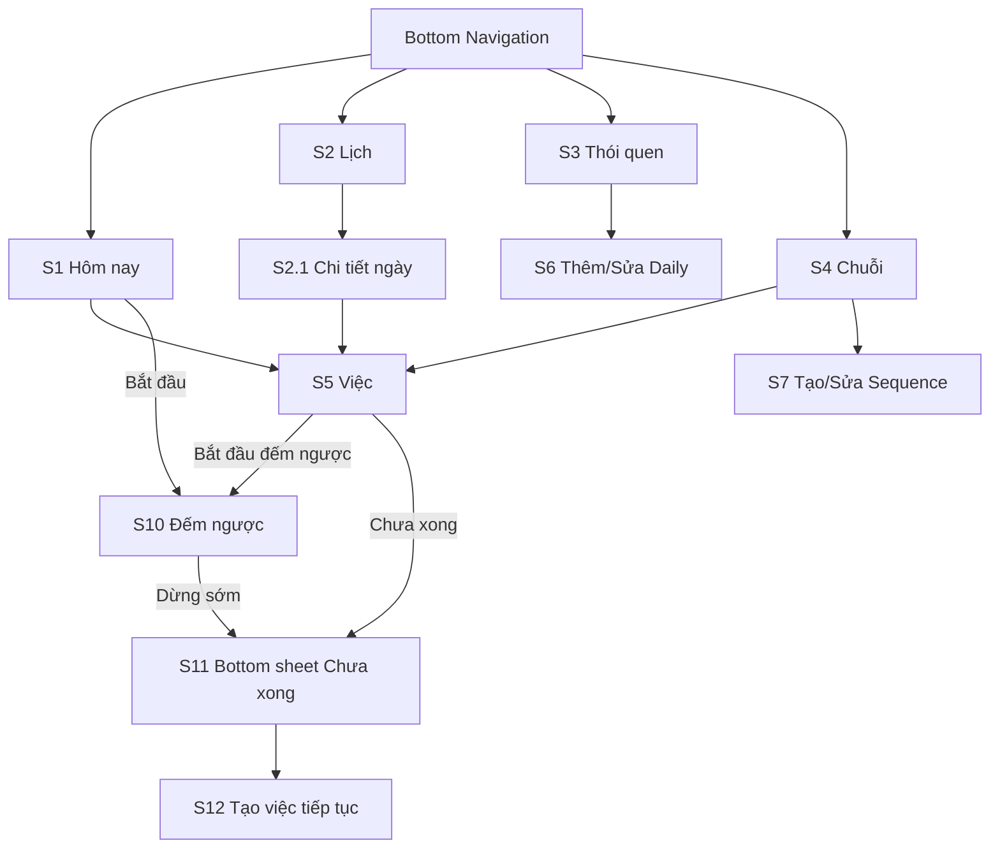
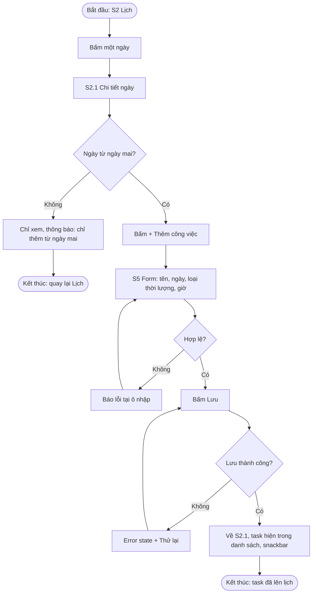
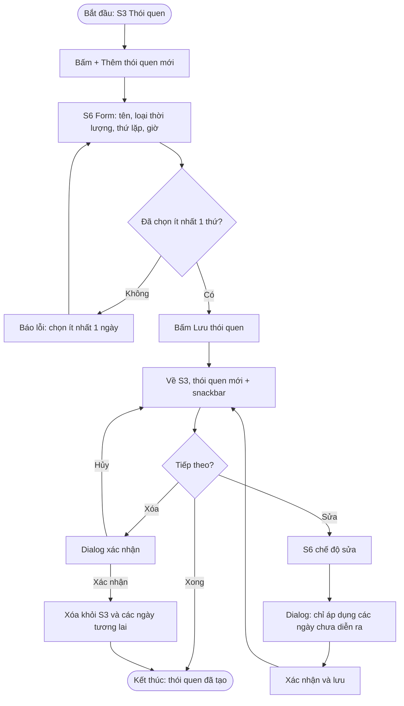
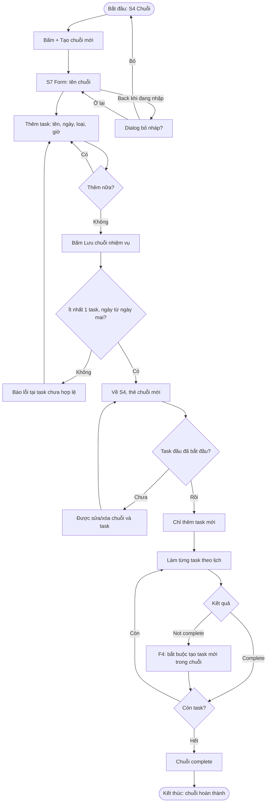
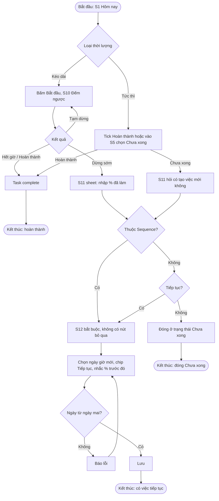
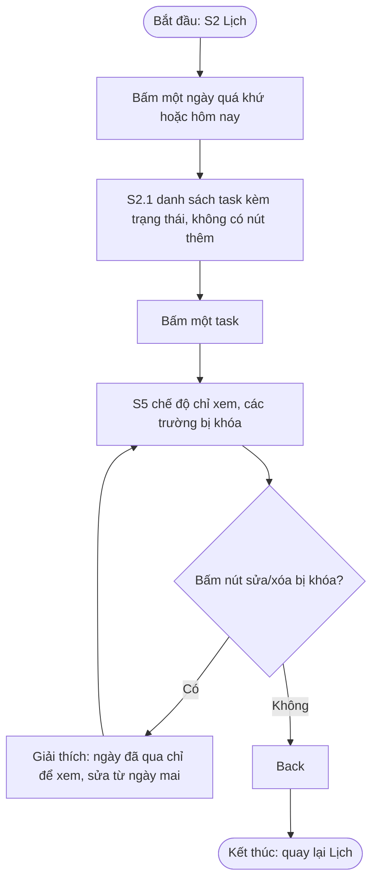

# ux/user-flow.md

## 0. Quy ước

- ✅ **Đã chốt:** S1 đến S4 (4 tab chính).
- ✏️ **Có thể chỉnh sửa:** các màn còn lại và flow dùng chúng. Khi đổi, cập nhật bảng ánh xạ ở mục 4 và nhật ký ở mục 5.

### Quy tắc nghiệp vụ

| # | Quy tắc |
|---|---|
| R1 | Chỉ thêm, sửa, xóa task từ **ngày mai** trở đi. Hôm nay và quá khứ chỉ để xem. |
| R2 | **Daily** sửa được bất cứ lúc nào, chỉ ảnh hưởng các ngày chưa diễn ra; ngày đã qua giữ nguyên. |
| R3 | **Sequence** chỉ sửa/xóa được trước khi task đầu tiên bắt đầu. Sau đó chỉ thêm task mới; task chưa diễn ra không sửa được, chỉ đánh Not complete. |
| R4 | Not complete (Normal, Daily): tức thì thì hỏi có tạo task mới không; kéo dài thì hỏi % đã làm rồi hỏi có tiếp tục không. Task mới có chip "Tiếp tục" và hiện % trước đó. |
| R5 | Not complete trong **Sequence**: bắt buộc tạo task mới trong chuỗi. Chuỗi complete khi hết task. |
| R6 | Đếm ngược chỉ cho task **kéo dài** và chỉ trong **hôm nay** (thực thi, không phải sửa kế hoạch). |

## 1. Information Architecture

### 1.1 Cấp cao nhất (Bottom Navigation, 4 tab)

| Mã | Màn hình | Vai trò | Trạng thái |
|---|---|---|---|
| S1 | Hôm nay | Danh sách task hôm nay, tick nhanh hoàn thành, task sắp tới được làm nổi | ✅ |
| S2 | Lịch | Lịch tháng lớn, chọn một ngày; đánh dấu hôm nay | ✅ |
| S3 | Thói quen | Danh sách Daily, nút "+ Thêm thói quen mới" | ✅ |
| S4 | Chuỗi | Danh sách chuỗi, mỗi thẻ mở ra các task; nút "+ Tạo chuỗi mới" | ✅ |

### 1.2 Màn hình lồng bên trong

| Mã | Màn hình | Đi từ | Trạng thái |
|---|---|---|---|
| S2.1 | Chi tiết ngày (như S1, thêm nút thêm task nếu ngày từ ngày mai) | S2 | ✏️ |
| S5 | Việc: thêm / xem / sửa (Normal và task trong chuỗi) | S1, S2.1, S4 | ✏️ |
| S6 | Thêm / sửa Daily | S3 | ✏️ |
| S7 | Tạo / sửa Sequence | S4 | ✏️ |
| S10 | Đếm ngược (task kéo dài, hôm nay) | S1, S5 | ✏️ |
| S11 | Hỏi khi Not complete (bottom sheet, overlay) | S5, S10 | ✏️ |
| S12 | Tạo task tiếp tục (form điền sẵn) | S11 | ✏️ |

S11 là overlay nên không tính vào 8 màn tối thiểu. Còn 10 màn thật: S1, S2, S2.1, S3, S4, S5, S6, S7, S10, S12.

### 1.3 Điều hướng

### 1.4 Ghi chú

- Không có màn chọn loại task: loại task do tab hoặc nút tạo quyết định (S2.1 tạo Normal, S3 tạo Daily, S4 tạo Sequence).
- S1 không có nút thêm, vì hôm nay chỉ để xem (R1). Muốn thêm việc, vào S2 chọn ngày từ ngày mai.
- Thẻ chuỗi ở S4 mở ngay ra danh sách task, nên không có màn "Chi tiết Sequence" riêng.

## 2. Quyết định tạm thời ✏️

| Điểm | Đề xuất | Lý do |
|---|---|---|
| Onboarding | Không | Persona bỏ ngang nếu nhiều bước |
| Tick nhanh ở S1 | Có (tick = Complete) | Mở app dưới 1 phút |
| Not complete từ S1 | Bấm vào task, vào S5 chọn "Chưa xong" | Tránh bấm nhầm |
| Tạm dừng trong S10 | Có; không kéo dài giờ kết thúc; % tính theo thời gian đã chạy | Giữ đúng lịch |
| Mất mạng | Lưu cục bộ; lưu/đồng bộ lỗi thì hiện error state có "Thử lại" | Persona hay mất mạng |

## 3. User flow ✏️

### F1. Thêm task Normal cho một ngày từ ngày mai

- **Bắt đầu:** S2 Lịch. **Mục tiêu:** lưu một task Normal. **Kết thúc:** task hiện ở S2.1 của ngày đó.
- **Nhánh thay thế:** ngày hôm nay/quá khứ (không có nút thêm, chỉ xem). **Nhánh lỗi:** chọn ngày không hợp lệ trong form, lưu thất bại.

### F2. Tạo Daily "Học tiếng Nhật 08:00-10:00, Thứ 7 và Chủ nhật"

- **Bắt đầu:** S3. **Mục tiêu:** thói quen lặp hằng tuần. **Kết thúc:** về S3, thấy thói quen vừa tạo.
- **Nhánh thay thế:** sửa Daily (cảnh báo chỉ áp dụng ngày chưa diễn ra), xóa Daily (dialog xác nhận). **Nhánh lỗi:** chưa chọn ngày nào.

### F3. Tạo Sequence và hoàn thành chuỗi

- **Bắt đầu:** S4. **Mục tiêu:** chuỗi nhiệm vụ (ví dụ "Làm project") hoàn thành. **Kết thúc:** chuỗi ở trạng thái complete.
- **Nhánh thay thế:** chuỗi chưa bắt đầu thì sửa/xóa được; đã bắt đầu thì chỉ thêm task (R3); bỏ nháp. **Nhánh lỗi/phục hồi:** task Not complete bắt buộc tạo task mới (R5, xem F4).

### F4. Thực hiện task và xử lý khi chưa xong (nhánh phục hồi chính)

- **Bắt đầu:** S1 Hôm nay. **Mục tiêu:** làm xong, hoặc nếu chưa xong thì không bỏ dở.
- **Kết thúc:** task complete, hoặc có task tiếp tục, hoặc task đóng Not complete (chỉ Normal/Daily).

### F5. Xem lại quá khứ (chỉ xem)

- **Bắt đầu:** S2. **Mục tiêu:** xem task ngày cũ, hiểu vì sao không sửa được. **Kết thúc:** quay lại Lịch.

## 4. Bảng ánh xạ flow sang màn hình ✏️

| Flow | Tên | Màn hình | Nhánh lỗi/phục hồi |
|---|---|---|---|
| F1 | Thêm Normal | S2, S2.1, S5 | Ngày không hợp lệ; lưu thất bại |
| F2 | Tạo Daily | S3, S6 | Chưa chọn thứ; xóa có xác nhận |
| F3 | Tạo Sequence, hoàn thành chuỗi | S4, S7, S5, S11, S12 | Bỏ nháp; Not complete bắt buộc tạo mới |
| F4 | Thực hiện và xử lý chưa xong | S1, S5, S10, S11, S12 | **Nhánh phục hồi chính** |
| F5 | Xem lại quá khứ | S2, S2.1, S5 | Nút sửa khóa kèm giải thích |

### Độ phủ

| Màn | Flow |
|---|---|
| S1 | F4 |
| S2 | F1, F5 |
| S2.1 | F1, F5 |
| S3 | F2 |
| S4 | F3 |
| S5 | F1, F3, F4, F5 |
| S6 | F2 |
| S7 | F3 |
| S10 | F4 |
| S11 | F3, F4 |
| S12 | F3, F4 |

Mọi màn đều thuộc ít nhất một flow.

## 5. Nhật ký thay đổi ✏️

| Thay đổi | Lý do |
|---|---|
| Bỏ màn chọn loại task | Giảm bước, thêm task dưới 20 giây |
| Thêm S2.1; S2 chỉ còn lịch | Vòng lặp 2 trong log |
| Bỏ nút "+" ở S1 | Hôm nay chỉ xem (R1) |
| Bỏ S8, S9; S4 mở thẻ ra task; S5 gộp xem/sửa/tạo | Đơn giản hóa (vòng lặp 5) |